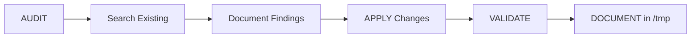

# Intake Module - Technical Governance Guide
> **OrbiPax Community Mental Health System**
>
> Single source of truth for maintaining SoC, clinical security, and architectural consistency

## Table of Contents
1. [Architecture & Layer Responsibilities](#architecture--layer-responsibilities)
2. [Folder Structure by Step](#folder-structure-by-step)
3. [Ports & Dependency Injection](#ports--dependency-injection)
4. [Server Actions & Guards](#server-actions--guards)
5. [PHI/HIPAA & Multi-tenant Rules](#phihipaa--multi-tenant-rules)
6. [UI/Accessibility Standards](#uiaccessibility-standards)
7. [AUDIT → APPLY Workflow](#audit--apply-workflow)
8. [Error Handling & Telemetry](#error-handling--telemetry)
9. [Anti-patterns (PROHIBITED)](#anti-patterns-prohibited)
10. [Validation Checklist](#validation-checklist)
11. [Contributing Guide](#contributing-guide)

---

## Architecture & Layer Responsibilities

### Layer Hierarchy
```
UI Layer → Actions Layer → Application Layer → Domain Layer → Infrastructure Layer
```

### Responsibility Matrix

| Layer | ✅ ALLOWED | ❌ PROHIBITED |
|-------|-----------|--------------|
| **UI** | • React components<br>• Form state (RHF)<br>• Display logic<br>• Event handlers<br>• Call server actions | • Business logic<br>• Direct DB access<br>• PHI in state<br>• Validation schemas<br>• Console.log |
| **Actions** | • Auth guards<br>• Session management<br>• Dependency composition<br>• Error mapping<br>• Delegate to Application | • Business logic<br>• Direct validation<br>• Domain imports<br>• PHI in errors<br>• Side effects |
| **Application** | • Use cases<br>• DTOs<br>• Mappers<br>• Port interfaces<br>• Orchestration | • Infrastructure imports<br>• UI imports<br>• Concrete implementations<br>• PHI logging |
| **Domain** | • Schemas (Zod)<br>• Types<br>• Business rules<br>• Constants<br>• Validation | • External dependencies<br>• I/O operations<br>• Framework code<br>• Mutable state |
| **Infrastructure** | • Repository impl<br>• External APIs<br>• Supabase client<br>• File system<br>• Adapters | • Business logic<br>• Domain logic<br>• UI concerns<br>• Direct exports |
| **State** | • UI state only<br>• Zustand stores<br>• Selectors<br>• UI preferences | • Business data<br>• PHI/PII<br>• Server state<br>• Side effects |

### Quick Checklist
- [ ] Each layer imports ONLY from layers below
- [ ] No circular dependencies
- [ ] Application defines ports, Infrastructure implements
- [ ] Actions compose dependencies
- [ ] Domain has zero external dependencies

---

## Folder Structure by Step

### Standard Structure per Step
```
src/modules/intake/
├── domain/
│   ├── schemas/
│   │   ├── demographics.schema.ts    # Step 1
│   │   ├── insurance.schema.ts       # Step 2
│   │   └── [step-name].schema.ts     # One per step
│   └── types/
│       └── common.ts                  # Shared types
├── application/
│   ├── step1/
│   │   ├── dtos.ts                   # Data Transfer Objects
│   │   ├── mappers.ts                # DTO ↔ Domain mappers
│   │   ├── usecases.ts               # Business logic
│   │   ├── ports.ts                  # Repository interface
│   │   └── index.ts                  # Public exports
│   └── step[N]/                      # Same structure
├── infrastructure/
│   └── repositories/
│       ├── demographics.repository.ts # Step 1 impl
│       └── [step-name].repository.ts  # One per step
├── actions/
│   ├── step1/
│   │   ├── demographics.actions.ts   # Server actions
│   │   └── index.ts                  # Exports
│   └── step[N]/                      # One folder per step
├── ui/
│   └── step1-demographics/
│       └── components/               # React components
└── state/
    ├── slices/                       # UI state only
    └── selectors/                    # UI selectors

```

### Naming Conventions
- Domain schemas: `[step-name].schema.ts`
- Repositories: `[step-name].repository.ts`
- Actions: `[step-name].actions.ts`
- UI folders: `step[N]-[name]/`

---

## Ports & Dependency Injection

### Dependency Flow
```
1. Application defines port (interface)
         ↓
2. Infrastructure implements port
         ↓
3. Actions compose and inject
```

### Implementation Pattern

#### 1. Port Definition (Application)
```typescript
// application/step1/ports.ts
export interface DemographicsRepository {
  findBySession(sessionId: string, organizationId: string): Promise<Result>
  save(sessionId: string, organizationId: string, data: DTO): Promise<Result>
}
```

#### 2. Implementation (Infrastructure)
```typescript
// infrastructure/repositories/demographics.repository.ts
import type { DemographicsRepository } from '@/modules/intake/application/step1/ports'

export class DemographicsRepositoryImpl implements DemographicsRepository {
  // Concrete Supabase implementation
}
```

#### 3. Composition (Actions)
```typescript
// actions/step1/demographics.actions.ts
import { demographicsRepository } from '@/modules/intake/infrastructure/repositories/demographics.repository'
import { loadDemographics } from '@/modules/intake/application/step1'

const result = await loadDemographics(demographicsRepository, sessionId, orgId)
```

### DI Rules
- [ ] Ports ALWAYS in Application layer
- [ ] NO Infrastructure imports in Application
- [ ] Actions are the ONLY composition root
- [ ] Use constructor injection for testability

---

## Server Actions & Guards

### Standard Action Structure
```typescript
'use server'

export async function actionName(input?: DTO): Promise<ActionResponse<T>> {
  // 1. Auth guard
  const { userId, organizationId } = await resolveUserAndOrg()

  // 2. Input validation (basic)
  if (!requiredField) return { ok: false, error: { code: 'INVALID_INPUT' } }

  // 3. Compose dependencies
  const repository = new RepositoryImpl()

  // 4. Delegate to Application
  const result = await useCase(repository, input, sessionId, organizationId)

  // 5. Map response
  return {
    ok: result.ok,
    data: result.data,
    error: result.error ? { code: result.error.code, message: 'Generic message' } : undefined
  }
}
```

### Response Contract
```typescript
type ActionResponse<T = void> = {
  ok: boolean
  data?: T
  error?: {
    code: string      // Generic code
    message?: string  // NO PHI/PII
  }
}
```

### Guard Order
1. Authentication (`resolveUserAndOrg`)
2. Organization validation
3. Session validation
4. Rate limiting (if applicable)
5. Business delegation

---

## PHI/HIPAA & Multi-tenant Rules

### PROHIBITED (Automatic Failure)
- ❌ PHI in console.log
- ❌ PHI in error messages
- ❌ PHI in UI state stores
- ❌ Cross-organization queries
- ❌ Unencrypted PHI storage
- ❌ PHI in URLs/query params
- ❌ PHI in telemetry/analytics

### REQUIRED Security Measures

#### Row Level Security (RLS)
```sql
-- Every table with PHI
ALTER TABLE intake_demographics ENABLE ROW LEVEL SECURITY;

CREATE POLICY "Organization isolation"
  ON intake_demographics
  FOR ALL
  USING (organization_id = current_setting('app.organization_id')::UUID);
```

#### Multi-tenant Boundaries
- [ ] EVERY query includes organization_id
- [ ] RLS policies on all tables
- [ ] Organization context in auth
- [ ] Audit logs for PHI access
- [ ] Session scoped by organization

#### Error Handling
```typescript
// ✅ CORRECT
return { ok: false, error: { code: 'VALIDATION_FAILED' } }

// ❌ WRONG
return { ok: false, error: { message: `Patient ${name} not found` } }
```

---

## UI/Accessibility Standards

### Design System Rules
- [ ] Tailwind v4 with CSS variables ONLY
- [ ] Semantic tokens: `var(--color-primary)`
- [ ] NO hardcoded colors: `text-blue-500` ❌
- [ ] Components from `/shared/ui/primitives`

### WCAG 2.2 Requirements
```tsx
// ✅ CORRECT Error Display
<div
  role="alert"
  aria-live="assertive"
  aria-describedby="error-desc"
  className="text-[var(--text-error)]"
>
  <span id="error-desc">{error}</span>
</div>

// ✅ CORRECT Form Field
<FormField
  name="firstName"
  render={({ field }) => (
    <FormItem>
      <FormLabel htmlFor="firstName">First Name</FormLabel>
      <FormControl>
        <Input
          {...field}
          id="firstName"
          aria-invalid={!!errors.firstName}
          aria-describedby={errors.firstName ? "firstName-error" : undefined}
        />
      </FormControl>
      {errors.firstName && (
        <FormMessage id="firstName-error" role="alert" />
      )}
    </FormItem>
  )}
/>
```

### Validation Display
- [ ] Inline errors with `role="alert"`
- [ ] NO toast notifications for validation
- [ ] Focus management on error
- [ ] aria-invalid on fields
- [ ] aria-describedby for associations

---

## AUDIT → APPLY Workflow

### MANDATORY Process


### AUDIT Phase Checklist
- [ ] Search for existing patterns
- [ ] Check Domain schemas
- [ ] Review Application use cases
- [ ] Identify reusable components
- [ ] Document in `/tmp/audit_[feature].md`

### APPLY Phase Rules
- [ ] ONE task at a time
- [ ] Follow existing patterns
- [ ] No new abstractions without approval
- [ ] Test before moving to next
- [ ] Update documentation

### SENTINEL Validation
```bash
# Run before ANY commit
npm run typecheck
npm run lint
npm run test:affected
```

### Documentation Template
```markdown
# [Feature] Implementation Report
Date: YYYY-MM-DD
Module: src/modules/intake/[area]
Status: [Complete|In Progress]

## Changes Made
- File: [path] - [description]

## Patterns Used
- [Pattern name] from [reference]

## Validation Results
- TypeCheck: ✅/❌
- Lint: ✅/❌
- Tests: ✅/❌
```

---

## Error Handling & Telemetry

### Error Codes (Standard)
```typescript
const ERROR_CODES = {
  // Auth/Session
  UNAUTHORIZED: 'UNAUTHORIZED',
  SESSION_EXPIRED: 'SESSION_EXPIRED',

  // Validation
  VALIDATION_FAILED: 'VALIDATION_FAILED',
  INVALID_INPUT: 'INVALID_INPUT',

  // Resources
  NOT_FOUND: 'NOT_FOUND',
  CONFLICT: 'CONFLICT',

  // System
  INTERNAL_ERROR: 'INTERNAL_ERROR',
  SERVICE_UNAVAILABLE: 'SERVICE_UNAVAILABLE'
}
```

### Error Boundaries
```typescript
// Application layer
try {
  // business logic
} catch (error) {
  // Log internally (no PHI)
  logger.error('Use case failed', { useCase: 'loadDemographics' })

  // Return generic
  return { ok: false, error: { code: 'INTERNAL_ERROR' } }
}
```

### Telemetry Rules
- [ ] NO PHI in logs
- [ ] Use correlation IDs
- [ ] Log at boundaries only
- [ ] Structured logging
- [ ] Audit PHI access separately

---

## Anti-patterns (PROHIBITED)

### ❌ NEVER DO THIS

#### 1. PHI in State
```typescript
// ❌ WRONG
const usePatientStore = create((set) => ({
  patient: { ssn: '123-45-6789' } // PHI in client state!
}))
```

#### 2. Application → Infrastructure Import
```typescript
// ❌ WRONG - application/step1/usecases.ts
import { supabase } from '@/infrastructure/supabase' // Direct infra import!
```

#### 3. Business Logic in UI
```typescript
// ❌ WRONG - UI component
const isEligible = age > 18 && diagnosis === 'depression' // Business logic!
```

#### 4. Validation in Actions
```typescript
// ❌ WRONG - actions/step1/demographics.actions.ts
if (!email.includes('@')) return { error: 'Invalid email' } // Validation!
```

#### 5. Toasts for Validation
```typescript
// ❌ WRONG
toast.error('First name is required') // Use inline errors!
```

#### 6. Hardcoded Step Order
```typescript
// ❌ WRONG
const nextStep = currentStep === 1 ? 2 : 3 // Use config!
```

#### 7. Console.log with Data
```typescript
// ❌ WRONG
console.log('Patient data:', patientRecord) // PHI leak!
```

---

## Validation Checklist

### Before EVERY Commit
- [ ] **SoC**: No cross-layer imports
- [ ] **PHI**: No sensitive data in logs/errors
- [ ] **RLS**: Organization scoping verified
- [ ] **Imports**: Application → Domain only
- [ ] **DI**: Ports in Application, not Infrastructure
- [ ] **A11y**: ARIA attributes present
- [ ] **Tokens**: Using CSS variables
- [ ] **Errors**: Generic messages only
- [ ] **State**: No business data in UI stores
- [ ] **Docs**: Report in `/tmp` created

### Quick Commands
```bash
# Type check
npm run typecheck

# Lint check
npm run lint

# Find PHI leaks
grep -r "console.log" src/modules/intake/
grep -r "firstName\|lastName\|ssn\|dob" src/modules/intake/state/

# Check imports
grep -r "infrastructure" src/modules/intake/application/
grep -r "application" src/modules/intake/domain/
```

---

## Contributing Guide

### Step-by-Step Process

#### 1. AUDIT Phase
```bash
# Search existing patterns
grep -r "similar-feature" src/modules/intake/

# Review schemas
ls src/modules/intake/domain/schemas/

# Check for reusable code
find src/modules/intake -name "*.tsx" -o -name "*.ts"

# Document findings
echo "# Audit Report" > /tmp/audit_feature_name.md
```

#### 2. APPLY Phase
```bash
# Create feature branch
git checkout -b feat/intake-step-name

# Implement ONE change at a time
# Follow folder structure above

# Test immediately
npm run typecheck
```

#### 3. VALIDATE Phase
```bash
# Run full validation
npm run typecheck && npm run lint && npm run test

# Check for PHI leaks
./scripts/check-phi-leaks.sh

# Verify imports
./scripts/check-soc.sh
```

#### 4. DOCUMENT Phase
```bash
# Create report
cat > /tmp/implementation_report.md << EOF
# Implementation Report
Date: $(date +%Y-%m-%d)
Module: src/modules/intake/...
Status: Complete

## Files Changed
- [List files]

## Validation Results
- TypeCheck: ✅
- Lint: ✅
- PHI Check: ✅
EOF
```

### Prompt Templates

#### AUDIT Prompt
```
AUDIT [Feature Name] in Intake module:
- Search for existing [pattern/component]
- Review Domain schemas for [entity]
- Check Application layer for similar use cases
- Identify reusable UI components
- Document findings in /tmp/audit_[feature].md
```

#### APPLY Prompt
```
APPLY [Feature Name] to Intake module:
- Single task: [specific task]
- Follow existing pattern from [reference]
- Maintain SoC: [layer] responsibility only
- Use port/DI pattern for repository
- Document in /tmp/apply_[feature].md
```

### Getting Help
- Architecture questions: Check this README first
- Pattern examples: See `src/modules/intake/application/step1/`
- Security concerns: Review PHI/HIPAA section
- UI components: Use `/shared/ui/primitives`

---

## Quick Reference Card

### File Naming
- Schemas: `[entity].schema.ts`
- DTOs: `dtos.ts` per step
- Mappers: `mappers.ts` per step
- Use cases: `usecases.ts` per step
- Ports: `ports.ts` per step
- Actions: `[entity].actions.ts`

### Import Rules
```typescript
// ✅ ALLOWED
Application → Domain
Infrastructure → Application (ports only)
Actions → Infrastructure & Application
UI → Actions

// ❌ PROHIBITED
Application → Infrastructure
Domain → Any other layer
Infrastructure → UI
State → Domain/Application
```

### Standard Returns
```typescript
// Application/Infrastructure
{ ok: boolean; data?: T; error?: { code: string } }

// Actions
{ ok: boolean; data?: T; error?: { code: string; message?: string } }
```

---

*Last Updated: 2025-09-28*
*Maintained by: OrbiPax Development Team*
*Version: 1.0.0*