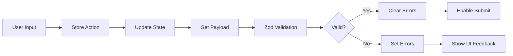

# Step 4: Medical Providers - Implementation Guide

## 📋 Overview

Step 4 of the intake wizard collects medical provider information across four main sections:
1. **Primary Care Provider (PCP)** - ✅ UI Complete, Zod/Store Wired
2. **Psychiatrist/Clinical Evaluator** - ✅ UI Complete, Pending Wiring
3. **Psychiatric Evaluation** - 🚧 UI Pending
4. **Functional Assessment** - 🚧 UI Pending

This guide documents the complete architecture, patterns, and implementation details for maintaining and extending Step 4.

---

## 🏗️ Architecture

### Layer Separation (SoC)
```
UI Layer (Components) → Application Layer (Stores) → Domain Layer (Schemas) → Infrastructure (API)
```

### File Structure
```
src/modules/intake/
├── ui/step4-medical-providers/
│   ├── Step4MedicalProviders.tsx          # Main aggregator component
│   ├── components/
│   │   ├── ProvidersSection.tsx           # PCP section (✅ Complete)
│   │   └── PsychiatristEvaluatorSection.tsx # Psychiatrist section (UI only)
│   └── README.md                           # This file
├── domain/schemas/step4/
│   ├── providers.schema.ts                # PCP Zod schema
│   ├── psychiatrist.schema.ts             # Psychiatrist Zod schema
│   ├── psychiatricEvaluation.schema.ts   # Evaluation Zod schema
│   ├── functionalAssessment.schema.ts     # Assessment Zod schema
│   └── index.ts                            # Aggregate exports
└── state/slices/step4/
    ├── providers.ui.slice.ts              # PCP UI store
    ├── psychiatrist.ui.slice.ts           # Psychiatrist UI store
    ├── psychiatricEvaluation.ui.slice.ts  # Evaluation UI store
    ├── functionalAssessment.ui.slice.ts   # Assessment UI store
    └── index.ts                            # Store aggregators
```

---

## 🔧 Implementation Status

### ✅ Phase 1: Schemas & Stores (Complete)
All Zod schemas and Zustand stores created for:
- Validation rules with conditional logic
- UI state management (no PHI persistence)
- Type-safe interfaces

### ✅ Phase 2: UI Components
| Section | UI Component | Store Wiring | Validation |
|---------|-------------|--------------|------------|
| PCP | ✅ Complete | ✅ Complete | ✅ Complete |
| Psychiatrist | ✅ Complete | ⏳ Pending | ⏳ Pending |
| Psychiatric Eval | ⏳ Pending | ⏳ Pending | ⏳ Pending |
| Functional Assessment | ⏳ Pending | ⏳ Pending | ⏳ Pending |

---

## 💻 Development Patterns

### Component Pattern (ProvidersSection Example)
```typescript
'use client'

import { useProvidersUIStore } from '@/modules/intake/state/slices/step4'
import { validateProviders } from '@/modules/intake/domain/schemas/step4'

export function ProvidersSection() {
  // 1. Connect to store
  const {
    hasPCP,
    pcpName,
    validationErrors,
    setHasPCP,
    setPCPField,
    setValidationErrors,
    resetConditionalFields
  } = useProvidersUIStore()

  // 2. Validate with Zod
  const validateFields = useCallback(() => {
    const payload = getPayload()
    const result = validateProviders(payload)

    if (!result.success) {
      // Map Zod errors to UI
      const errors: Record<string, string> = {}
      result.error.issues.forEach((issue) => {
        // Custom error messages
      })
      setValidationErrors(errors)
      return false
    }

    setValidationErrors({})
    return true
  }, [getPayload, setValidationErrors])

  // 3. Conditional field handling
  const handleHasPCPChange = (value: 'Yes' | 'No' | 'Unknown') => {
    setHasPCP(value)
    if (value !== 'Yes') {
      resetConditionalFields() // Clears dependent fields
    }
  }

  // 4. Render with accessibility
  return (
    <Card>
      {/* Header with collapse/expand */}
      {/* Form fields with ARIA attributes */}
      {/* Conditional rendering based on selections */}
    </Card>
  )
}
```

### Store Pattern (UI-Only, No PHI Persistence)
```typescript
interface ProvidersUIState {
  // Form fields
  hasPCP?: 'Yes' | 'No' | 'Unknown'
  pcpName?: string
  pcpPhone?: string

  // UI state
  isExpanded: boolean
  validationErrors: Record<string, string>
  isDirty: boolean
}

export const useProvidersUIStore = create<State & Actions>()(
  devtools(
    (set, get) => ({
      ...initialState,

      setHasPCP: (value) => set((state) => {
        if (value !== 'Yes') {
          // Clear conditional fields
          return {
            hasPCP: value,
            pcpName: '',
            pcpPhone: '',
            validationErrors: {}
          }
        }
        return { hasPCP: value }
      }),

      resetConditionalFields: () => set({
        pcpName: '',
        pcpPhone: '',
        pcpPractice: '',
        pcpAddress: '',
        authorizedToShare: false,
        validationErrors: {}
      })
    }),
    { name: 'providers-ui-store' }
  )
)
```

### Schema Pattern (Zod with Conditional Validation)
```typescript
export const providersSchema = z.object({
  hasPCP: z.enum(['Yes', 'No', 'Unknown']),

  pcpName: z.string().max(120).optional(),
  pcpPhone: z.string().transform(normalizePhoneNumber).optional(),

}).refine(
  (data) => {
    // If hasPCP is 'Yes', name and phone are required
    if (data.hasPCP === 'Yes') {
      return !!(
        data.pcpName?.trim() &&
        data.pcpPhone &&
        data.pcpPhone.length >= 10
      )
    }
    return true
  },
  { message: 'Provider details required when you have a PCP' }
)
```

---

## 🎯 Key Implementation Rules

### 1. Conditional Fields
- Fields shown/hidden based on parent selection
- When parent changes from "Yes" to "No/Unknown", clear all child fields
- Use `resetConditionalFields()` from store

### 2. Validation
- Client-side: Zod schemas with `.safeParse()`
- Show field-specific error messages
- Clear errors when user corrects input
- Validate on submit, not on every keystroke

### 3. Phone Number Handling
```typescript
// Normalize for storage (digits only)
const normalizePhoneNumber = (phone: string): string => {
  return phone.replace(/\D/g, '')
}

// Format for display
const formatPhoneDisplay = (phone: string): string => {
  const normalized = normalizePhoneNumber(phone)
  if (normalized.length < 10) return phone

  const areaCode = normalized.slice(0, 3)
  const prefix = normalized.slice(3, 6)
  const lineNumber = normalized.slice(6, 10)

  return `(${areaCode}) ${prefix}-${lineNumber}`
}

// Validate minimum length
const isValidPhone = (phone: string): boolean => {
  return normalizePhoneNumber(phone).length >= 10
}
```

### 4. Character Limits
| Field Type | Limit | Implementation |
|------------|-------|----------------|
| Names | 120 chars | `maxLength={120}` + onChange prevention |
| Addresses | 200 chars | `maxLength={200}` + onChange prevention |
| Notes | 300 chars | `maxLength={300}` + onChange prevention |

### 5. Accessibility (WCAG 2.1 AA)
```tsx
<Input
  id="pcp-name"
  aria-required="true"
  aria-invalid={!!validationErrors['pcpName']}
  aria-describedby={validationErrors['pcpName'] ? "pcp-name-error" : undefined}
  aria-label="Provider Name"
/>
{validationErrors['pcpName'] && (
  <p id="pcp-name-error" className="text-sm text-[var(--destructive)]" role="alert">
    {validationErrors['pcpName']}
  </p>
)}
```

### 6. Semantic Tokens (No Hardcoded Colors)
```css
/* ✅ CORRECT - Using semantic tokens */
text-[var(--destructive)]     /* Error text */
text-[var(--primary)]          /* Primary accent */
text-[var(--foreground)]       /* Regular text */
ring-[var(--ring-primary)]     /* Focus ring */

/* ❌ WRONG - Never hardcode colors */
text-red-500
border-#FF0000
```

---

## 🔄 Data Flow

### User Input → Store → Validation → UI Feedback


### Submit Flow
```typescript
const handleStepSubmit = async () => {
  // 1. Validate all sections
  const providersValid = validateProviders(providersPayload)
  const psychiatristValid = validatePsychiatrist(psychiatristPayload)
  // ... other sections

  // 2. Aggregate payloads
  if (allValid) {
    const step4Data = {
      providers: providersPayload,
      psychiatrist: psychiatristPayload,
      psychiatricEvaluation: evaluationPayload,
      functionalAssessment: assessmentPayload
    }

    // 3. Send to API (when ready)
    // await submitStep4(step4Data)
  }
}
```

---

## 🧪 Testing Checklist

### For Each Section
- [ ] All fields connect to store (no local state)
- [ ] Zod validation runs on submit
- [ ] Error messages are field-specific and accessible
- [ ] Conditional fields clear when parent changes
- [ ] Character limits enforced
- [ ] Phone numbers normalize correctly
- [ ] No console.* statements
- [ ] No hardcoded colors
- [ ] TypeScript strict (no `any`)
- [ ] ESLint passes

### E2E Scenarios
1. **Empty Submit** → Show all required field errors
2. **Partial Data** → Show only missing required fields
3. **Invalid Phone** → Show specific phone error
4. **Exceed Limits** → Prevent input or show error
5. **Yes → No** → Clear conditional fields
6. **Complete Valid** → Submit succeeds

---

## 📝 Adding New Sections

### 1. Create Schema
```typescript
// domain/schemas/step4/newSection.schema.ts
export const newSectionSchema = z.object({
  mainField: z.enum(['Option1', 'Option2']),
  conditionalField: z.string().optional()
}).refine(/* conditional logic */)
```

### 2. Create Store Slice
```typescript
// state/slices/step4/newSection.ui.slice.ts
export const useNewSectionUIStore = create<State & Actions>()(
  devtools((set) => ({
    // Initial state
    mainField: undefined,
    conditionalField: '',
    isExpanded: false,
    validationErrors: {},

    // Actions
    setMainField: (value) => set({ mainField: value }),
    resetSection: () => set(initialState)
  }))
)
```

### 3. Create UI Component
```typescript
// ui/step4-medical-providers/components/NewSection.tsx
export function NewSection() {
  const store = useNewSectionUIStore()
  // Implement UI following patterns above
}
```

### 4. Add to Aggregator
```typescript
// ui/step4-medical-providers/Step4MedicalProviders.tsx
import { NewSection } from './components/NewSection'

export function Step4MedicalProviders() {
  return (
    <>
      <ProvidersSection />
      <PsychiatristEvaluatorSection />
      <NewSection /> {/* Add here */}
    </>
  )
}
```

---

## 🚀 Deployment Checklist

### Before Production
- [ ] All sections have UI components
- [ ] All sections wired to stores
- [ ] Validation working for all fields
- [ ] No PHI in browser storage
- [ ] Accessibility audit passed
- [ ] Performance profiling done
- [ ] Error boundaries in place
- [ ] Loading states implemented
- [ ] Submit to API integrated

### Feature Flags (if needed)
```typescript
const USE_NEW_STEP4 = process.env.NEXT_PUBLIC_USE_NEW_STEP4 === 'true'

if (USE_NEW_STEP4) {
  // New implementation
} else {
  // Legacy fallback
}
```

---

## 🔒 Security Considerations

### No PHI Persistence
```typescript
// ❌ NEVER persist sensitive data
persist((state) => state, {
  name: 'step4-store',
  // This would persist PHI - DON'T DO THIS
})

// ✅ If persistence needed, only persist UI flags
persist((state) => state, {
  name: 'step4-ui-flags',
  partialize: (state) => ({
    isExpanded: state.isExpanded,
    hasPCP: state.hasPCP // OK - just the flag
    // NOT pcpName, pcpPhone, etc.
  })
})
```

### Input Sanitization
- Trim whitespace on validation
- Normalize phone numbers
- Enforce character limits
- No HTML/script injection

---

## 📚 Resources

### Internal Documentation
- [SoC Architecture](../../docs/soc/README.md)
- [Intake Wizard Context](../../legacy/intake/layout/IntakeWizardContext.tsx)
- [Shared UI Primitives](../../../../shared/ui/primitives/)

### External References
- [Zod Documentation](https://zod.dev)
- [Zustand Documentation](https://github.com/pmndrs/zustand)
- [WCAG 2.1 Guidelines](https://www.w3.org/WAI/WCAG21/quickref/)
- [React Hook Form](https://react-hook-form.com) (if integrated later)

---

## 🐛 Known Issues & TODOs

### Current Issues
- [ ] DatePicker aria-describedby type mismatch in PsychiatristEvaluatorSection
- [ ] Some pre-existing TypeScript errors in other modules

### TODOs
- [ ] Wire PsychiatristEvaluatorSection to store/schema
- [ ] Create PsychiatricEvaluationSection component
- [ ] Create FunctionalAssessmentSection component
- [ ] Implement global submit handler
- [ ] Add API integration layer
- [ ] Add unit tests for validation logic
- [ ] Add E2E tests for complete flow
- [ ] Add loading/saving states
- [ ] Add error boundary
- [ ] Add analytics tracking

---

## 👥 Contributors

- **Initial Implementation**: Claude Code Assistant (2025-09-26)
- **Architecture Design**: Based on OrbiPax modular monolith pattern
- **Validation Patterns**: Zod + Zustand integration

---

## 📄 License

Proprietary - OrbiPax Community Mental Health System

---

**Last Updated**: 2025-09-26
**Version**: 1.0.0
**Status**: In Development (Phase 2 of 4)